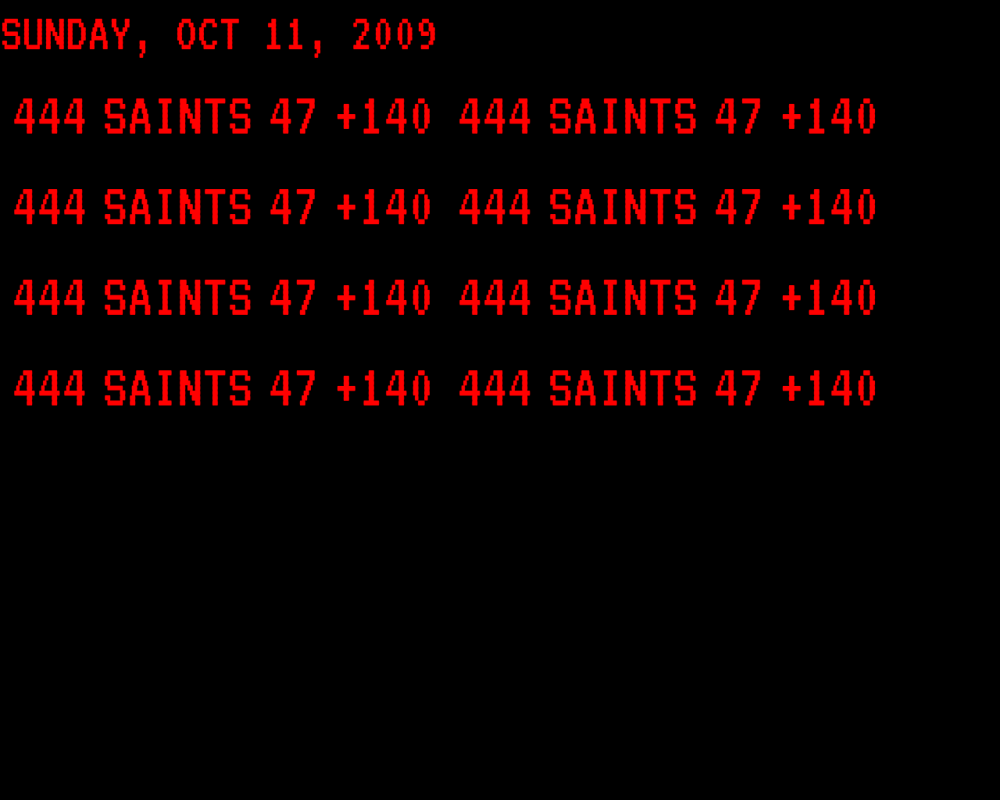

# I Desire To Receive Software Developer Immortality.

In this repository will find a generic source code repository with baked-in capability for Jenkins pipelines, automated docker image builds, automated DockerHub deploys, and self-contained documentation.



## Prologue

I did this for Her.

I did this for the Universe.

## About This Project

The Embassy
I put together a collection of content that goes into more detail about this repository.

So go read that repository documentation. Or don't, that's ok too.

Somewhere in there is RTFM humor.

[Read The Repository Documentation](repository-documentation/readme.md)

## What Is The Embassy?

My apartment. lol.

shout out to Drake.

shout out to [Drake](repository-documentation/readme.md).

```

All factual, I call the house "the embassy"

```
forget which song that was.

## Ciao

From my universe to yours.

with lots of love,

Software Shinobi

[www.softwareshinobi.digital](http://softwaredeveloperthings.com/softwareshinobi.digital/)

## Namaste.
